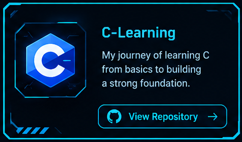

# Hi there! I'm Niladri Pal
 

 

 

  
### 🌐 SYSTEM_PROFILE // ABOUT_ME.exe

# 💻 Tech Stack:

## Languages

  

## Skills

  

## 📂 Featured Repositories

 

 

 

# 📊 GitHub Stats: 

 
 

## 💡 Philosophy

> **"Always exploring how hardware and software work together."**

I believe the best way to learn is to build. Every project teaches something new, whether it's writing cleaner code, understanding hardware more deeply, or solving real engineering problems.

Thanks for visiting my profile! Feel free to explore my repositories and follow my journey as I continue building, learning, and experimenting. 
 

# 📫 Connect with me

## 🌐 Social Links:

   

> "Code. Learn. Build. Repeat."
